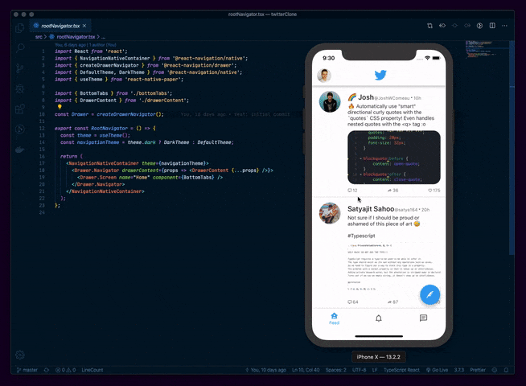

<h1 align="center">
  React Navigation v5 + React Native Paper = ❤️
</h1>

<h3 align="center">
This is a clone of the Twitter app implemented for the purpose of <a href="https://reactnavigation.org/blog/2020/01/29/using-react-navigation-5-with-react-native-paper.html">this blog post</a> 
</h3>

